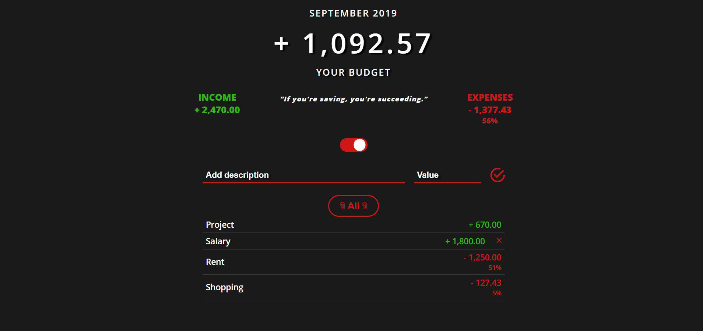

# Show Me The Budget
Simple app where you can add your incomes, expenses for given month and your available budget will be displayed on the screen. You can also delete items from the list.

## Features implemented:
- Local storage
- Delete All button
- Code changed to ES6
- Quote change - every day (API)

## Check Here ==> https://jakubfolta.github.io/ShowMeTheBudget/

## Budget App

## Technologies
* HTML5, CSS3, Sass, JavaScript ES6, NPM, Webpack/Babel

## Contact
Created by Jakub Folta [@folta.me](https://www.folta.me/) - feel free to contact me! 
